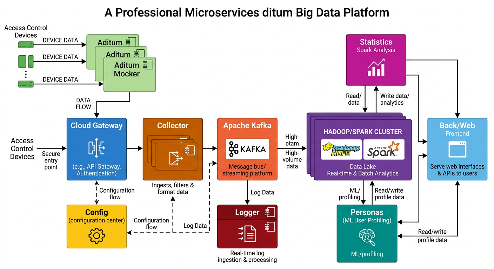
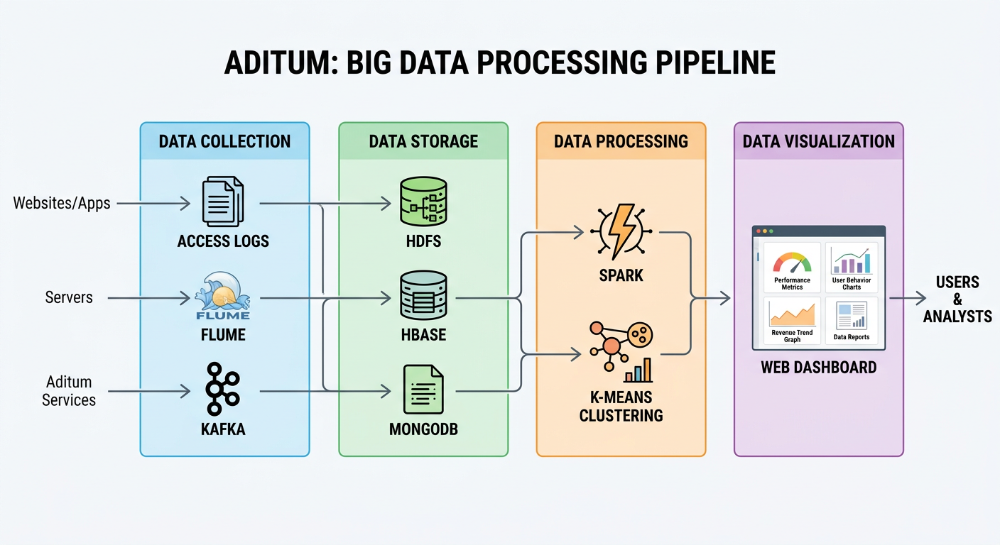

<p align="center">
  
</p>

<h1 align="center">Aditum</h1>

<p align="center">
  <strong>门禁访问控制大数据分析平台</strong><br/>
  <strong>Community Access Control Big Data Analysis System</strong>
</p>

<p align="center">
  
  
  
  
  
  
  
</p>

---

## 📖 项目简介

**Aditum** 是一个基于分布式架构的社区门禁访问控制大数据分析平台。系统通过采集社区门禁设备的访问日志，利用大数据技术进行实时处理和分析，为社区管理者提供智能化的数据分析服务。

### 核心能力

| 能力 | 技术实现 | 描述 |
|------|----------|------|
| **数据采集** | Flume + Kafka | 实时采集门禁设备访问日志 |
| **数据存储** | HDFS + HBase + MongoDB | 分布式数据存储方案 |
| **数据分析** | Spark + Scala | 大规模数据统计分析 |
| **用户画像** | Python + k-means | 基于聚类算法的用户行为分析 |
| **可视化** | Vue.js + REST API |  Web 端数据展示平台 |

---

## 🏗️ 系统架构

<p align="center">
  
</p>

### 微服务模块

```
Aditum/
├── aditum-cloud/          # 微服务网关 (API Gateway)
├── aditum-config/         # 云配置中心 (Config Server)
├── aditum-mocker/         # 数据模拟服务 (Data Simulation)
├── aditum-collector/      # 数据聚合服务 (Data Collection)
├── aditum-logger/         # 日志清洗服务 (Log Processing)
├── aditum-statistics/     # 统计分析服务 (Spark Analysis)
├── aditum-personas/       # 用户画像服务 (ML User Profiling)
├── aditum-back/           # RESTful 后端服务
├── aditum-web/            # Vue.js 前端展示
├── aditum-golang/         # Go 语言微服务
└── aditum-doc/            # 项目文档
```

---

## 🔄 数据处理流程

<p align="center">
  
</p>

### 1. 数据收集层 (Data Collection)

| 组件 | 技术 | 功能 |
|------|------|------|
| Access Logs | 门禁设备日志 | 原始访问记录采集 |
| Flume | 日志收集框架 | 分布式日志聚合 |
| Kafka | 消息队列 | 高吞吐数据缓冲 |

### 2. 数据存储层 (Data Storage)

| 数据库 | 用途 | 数据类型 |
|--------|------|----------|
| HDFS | 分布式文件系统 | 原始日志文件 |
| HBase | 列式数据库 | 结构化访问记录 |
| MongoDB | 文档数据库 | 用户画像数据 |

### 3. 数据处理层 (Data Processing)

| 服务 | 语言 | 技术栈 | 功能 |
|------|------|--------|------|
| Statistics | Scala | Spark, RDD | 实时统计分析 |
| Personas | Python | k-means, scikit-learn | 用户聚类分析 |

### 4. 数据可视化层 (Visualization)

- **前端**: Vue.js 单页应用
- **后端**: SpringBoot REST API
- **展示**: 实时数据仪表盘、报表系统

---

## 🚀 微服务详解

### Cloud 微服务网关

- **功能**: API 网关、服务路由、负载均衡
- **技术**: Spring Cloud Gateway
- [源码](https://github.com/kevinten10/Aditum-Cloud)

### Config 云配置中心

- **功能**: 集中式配置管理、动态配置更新
- **技术**: Spring Cloud Config
- [源码](https://github.com/kevinten10/Aditum-Config)

### Mocker 数据模拟服务

<p align="center">
  
</p>

- **语言**: Java
- **技术**: Quartz 定时调度、多线程
- **功能**:
  - 生成模拟门禁数据
  - 生成模拟日志数据
  - 确保数据合理性

### Collector 数据聚合服务

<p align="center">
  
</p>

- **语言**: Java
- **技术**: Flume, Kafka, HDFS, HBase
- **功能**:
  - 日志数据聚合
  - 消息队列生产
  - 分布式文件存储

### Logger 日志清洗服务

<p align="center">
  
</p>

- **语言**: Java
- **技术**: Kafka Consumer, 规则引擎
- **功能**:
  - 日志清洗规则建模
  - 数据匹配工具
  - Kafka 消息消费

### Statistics 统计分析服务

<p align="center">
  
</p>

- **语言**: Scala
- **技术**: Spark, Spark SQL, RDD
- **功能**:
  - Spark 计算引擎编程
  - Spark 多任务调度
  - 数据结构化建模

### Personas 用户画像服务

<p align="center">
  
</p>

- **语言**: Python
- **技术**: k-means 聚类、机器学习
- **功能**:
  - 用户行为聚类分析
  - 用户标签建模
  - 画像数据库存储

### Back/Web 前后端服务

- **后端**: SpringBoot + RESTful API
  - [源码](https://github.com/kevinten10/Aditum-Back)
- **前端**: Vue.js + Element UI
  - [源码](https://github.com/kevinten10/Aditum-Web)

---

## 🛠️ 技术栈

### 基础设施

| 组件 | 技术 | 说明 |
|------|------|------|
| 操作系统 | Linux (CentOS) | 服务器基础系统 |
| 容器化 | Docker | 微服务容器部署 |
| 数据库 | MySQL, HBase, MongoDB | 多类型数据存储 |
| 文件系统 | HDFS | 分布式文件存储 |
| 通信协议 | REST HTTP | 服务间通信 |

### 开发语言

| 语言 | 用途 | 框架/工具 |
|------|------|-----------|
| **Java** | 微服务开发 | Spring Boot, Spring Cloud |
| **Scala** | 大数据计算 | Spark, Spark SQL |
| **Python** | 机器学习 | scikit-learn, pandas |
| **Go** | 高性能服务 | Gin, Go Micro |
| **JavaScript** | 前端开发 | Vue.js, Element UI |

---

## 📊 应用场景

- **社区安防**: 实时门禁访问监控
- **人员管理**: 居民出入行为分析
- **异常检测**: 识别异常访问模式
- **用户画像**: 基于访问行为的用户分群
- **数据统计**: 日/周/月访问统计报表

---

## 🚀 快速开始

### 环境要求

- JDK 1.8+
- Python 3.7+
- Scala 2.12+
- Hadoop 2.7+
- Spark 2.4+
- MySQL 5.7+
- MongoDB 4.0+

### 本地部署

```bash
# 1. 克隆项目
git clone https://github.com/aditum-stack/Aditum.git
cd Aditum

# 2. 启动配置中心
cd aditum-config
mvn spring-boot:run

# 3. 启动网关服务
cd ../aditum-cloud
mvn spring-boot:run

# 4. 启动数据服务
cd ../aditum-collector
mvn spring-boot:run

# 5. 启动前端
cd ../aditum-web
npm install
npm run serve
```

### Docker 部署

```bash
cd docker
docker-compose up -d
```

---

## 📚 文档

详细架构文档请查看 [aditum-doc](./aditum-doc/) 目录：
- [微服务架构](./aditum-doc/微服务架构.JPG)
- [大数据平台架构](./aditum-doc/大数据平台架构.JPG)
- [微服务运行流程](./aditum-doc/微服务运行流程.JPG)

---

## 🤝 贡献指南

欢迎提交 Issue 和 Pull Request！

1. Fork 本仓库
2. 创建特性分支 (`git checkout -b feature/amazing-feature`)
3. 提交更改 (`git commit -m 'Add amazing feature'`)
4. 推送分支 (`git push origin feature/amazing-feature`)
5. 创建 Pull Request

---

## 📜 许可证

Copyright (c) 2018-present kevinten10

本项目采用 Apache License 2.0 许可证

---

<p align="center">
  <strong>智能门禁 · 大数据驱动 · 安全社区</strong>
</p>

<p align="center">
  
</p>
